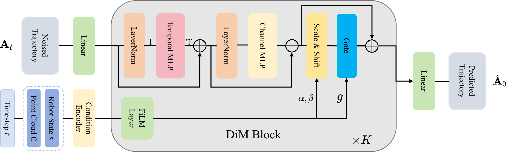

<h1 style="text-align:center; margin:0;">
  
  PocketDP3: Efficient Pocket-Scale 3D Visuomotor Policy
</h1>


<div align="center">


[](https://arxiv.org/abs/2601.22018)
[](LICENSE)
</div>

---


## 📋 Overview
<p align="center">
  
  <br>
  <em>PocketDP3: Efficient Pocket-Scale 3D Visuomotor Policy</em>
</p>

Our PocketDP3 adopts the efficient point-cloud encoder from DP3 and stacks $K$ DiM blocks as the decoder. Each DiM block is built upon an MLP-Mixer style architecture, enabling efficient information fusion with a small parameter budget, thereby improving decision-making performance.


## ⚙️ Installation

Our code is intended to be evaluated with the third-party benchmark [RoboTwin2.0](https://github.com/RoboTwin-Platform/RoboTwin). To reproduce results, you need to **copy** our policy folder into the RoboTwin repository and run RoboTwin’s training and evaluation scripts.

Clone our repository along with [RoboTwin](https://github.com/RoboTwin-Platform/RoboTwin):
```
git clone --recurse-submodules https://github.com/jhz1192/PocketDP3.git
```

Set up the runtime environment using the scripts provided by RoboTwin  official doc:

```
conda create -n PocketDP3 python=3.10 -y
conda activate PocketDP3
cd RoboTwin
bash script/_install.sh
pip install zarr==2.12.0 wandb ipdb gpustat dm_control omegaconf hydra-core==1.2.0 dill==0.3.5.1 einops==0.4.1 diffusers==0.11.1 numba==0.56.4 moviepy imageio av matplotlib termcolor
```
Note that PyTorch3D must be installed successfull. For more detailed installation instructions, please refer to the official [doc](https://robotwin-platform.github.io/doc/usage/robotwin-install.html).

Download assets:
```
bash script/_download_assets.sh
```

After setting up the environment, copy the `PocketDP3` folder into RoboTwin’s `policy/` directory:
```
cd ..
cp -r PocketDP3 RoboTwin/policy/
```

Install PocketDP3 by running:
```
cd RoboTwin/policy/PocketDP3/Pocket-3D-Diffusion-Policy
pip install -e .
cd ../../..
```

## 🚀 Usage
### Collect Data
We use the data collection scripts provided by [RoboTwin](https://robotwin-platform.github.io/doc/usage/collect-data.html):

```
bash collect_data.sh ${task_name} ${task_config} ${gpu_id}
# Example: bash collect_data.sh beat_block_hammer demo_clean 0
```
Note: Please set `datatype.pointcloud` to `true` in `task_config/demo_clean.yml`.

### Training and Evaluation

We provide pipeline scripts for training and evaluation:

```
cd policy/PocketDP3
bash pipeline.sh ${gpu_id}
```

Alternatively, you can run training and evaluation separately:

1. **Prepare Training Data:**
```
cd policy/PocketDP3
bash process_data.sh ${task_name} ${task_config} ${expert_data_num}
# Example: bash process_data.sh beat_block_hammer demo_clean 50
```

2. **Training PocketDP3 by:**
```
bash train.sh ${task_name} ${task_config} ${expert_data_num} ${seed} ${gpu_id}
# bash train.sh beat_block_hammer demo_clean 50 0 0
```

3. **Evaluate PocketDP3 by:**
```
bash eval.sh ${task_name} ${task_config} ${ckpt_setting} ${expert_data_num} ${seed} ${gpu_id}
# bash eval.sh beat_block_hammer demo_clean demo_clean 50 0 0
```

All training and evaluation follow the official DP3 scripts provided by RoboTwin. If you encounter any issues, please refer to the official [RoboTwin DP3 documentation](https://robotwin-platform.github.io/doc/usage/DP3.html).


💡**Tips:** For complex tasks, you may increase the model capacity (by adjusting `policy.mlp_hidden_dim` and `policy.mlp_depth` in `pocket_dp3.yaml`) to achieve better performance. In general, our base model (`mlp_hidden_dim=128`, `mlp_depth=4`) is sufficient to obtain strong results on most tasks.


## 📈 Results

### Performance on RoboTwin 2.0 Benchmark

Evaluation on the **RoboTwin 2.0** benchmark.

| Task | DP3 | **PocketDP3-tiny (Ours)** | Δ vs DP3 | **PocketDP3-base (Ours)** | Δ vs DP3 |
| :--- | :---: | :---: | :---: | :---: | :---: |
| Beat Block Hammer | 72.0% | **94.0%** | +22.0% | 92.0% | +20.0% |
| Click Alarmclock | 77.0% | 94.0% | +17.0% | **98.0%** | +21.0% |
| Click Bell | 90.0% | **100.0%** | +10.0% | **100.0%** | +10.0% |
| Hanging Mug | 17.0% | 29.0% | +12.0% | **39.0%** | +22.0% |
| Move Can Pot | 70.0% | 81.0% | +11.0% | **97.0%** | +27.0% |
| Move Pillbottle Pad | 41.0% | 45.0% | +4.0% | **53.0%** | +12.0% |
| Pick Diverse Bottles | 52.0% | **77.0%** | +25.0% | 74.0% | +22.0% |
| Pick Dual Bottles | 60.0% | 83.0% | +23.0% | **93.0%** | +33.0% |
| Place Bread Basket | 26.0% | **48.0%** | +22.0% | 41.0% | +15.0% |
| Place Bread Skillet | 19.0% | 38.0% | +19.0% | **52.0%** | +33.0% |
| Place Burger Fries | 72.0% | 74.0% | +2.0% | **86.0%** | +14.0% |
| Place Cans Plasticbox | 48.0% | **98.0%** | +50.0% | 95.0% | +47.0% |
| Place Empty Cup | 65.0% | 90.0% | +25.0% | **94.0%** | +29.0% |
| Place Object Stand | 60.0% | 61.0% | +1.0% | **72.0%** | +12.0% |
| Place Phone Stand | 44.0% | 55.0% | +11.0% | **63.0%** | +19.0% |
| Scan Object | 31.0% | 31.0% | +0.0% | **43.0%** | +12.0% |
| Stack Bowls Three | 57.0% | 63.0% | +6.0% | **72.0%** | +15.0% |
| Stamp Seal | 18.0% | 34.0% | +16.0% | **41.0%** | +23.0% |
| Turn Switch | 46.0% | **59.0%** | +13.0% | 56.0% | +10.0% |
| **Average** | 50.8% | **66.0%** | +15.2% | **71.6%** | +20.8% |

## 🎓 Citation

If you find PocketDP3 useful for your research, please kindly cite our paper:

```bibtex
@misc{zhang2026pocketdp3efficientpocketscale3d,
      title={PocketDP3: Efficient Pocket-Scale 3D Visuomotor Policy}, 
      author={Jinhao Zhang and Zhexuan Zhou and Huizhe Li and Yichen Lai and Wenlong Xia and Haoming Song and Youmin Gong and Jie Me},
      year={2026},
      eprint={2601.22018},
      archivePrefix={arXiv},
      primaryClass={cs.RO},
      url={https://arxiv.org/abs/2601.22018}, 
}
```

## 📄 License

This project is licensed under the Apache License 2.0 - see the [LICENSE](LICENSE) file for details.

## 🌟 Acknowledgments
- [Robotwin](https://robotwin-platform.github.io/) for the simulation bechmark
- [DP3](https://robotwin-platform.github.io/) for the strong baseline work

## ✉️ Contact

If you have any questions, please contact us at:
- Email: jinhaozhang0705@gmail.com
- GitHub Issues: [Open an issue](https://github.com/jhz1192/PocketDP3/issues)